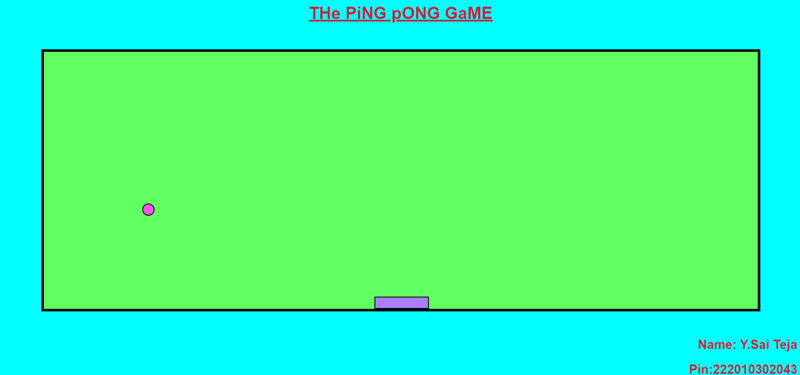

# The Ping Pong Game

Welcome to **The Ping Pong Game**, a classic arcade game implemented using HTML, CSS, and JavaScript. Prepare for an exciting and addictive gaming experience!

## Gameplay 🎮
- Control the paddle using the left and right arrow keys on your keyboard.
- Keep the ball in play by hitting it with the paddle.
- Aim to score as many points as possible by preventing the ball from falling off the screen.
- The ball will bounce off the walls and the paddle, making the game challenging and engaging.

## Technologies Used 💻
- HTML
- CSS
- JavaScript

## How to Run ▶️
1. Clone this repository to your local machine.
2. Navigate to the project directory.
3. Open the `index.html` file in your preferred web browser.
4. Start playing the Ping Pong Game and enjoy!

## Customization ✨
Feel free to customize and enhance the game according to your preferences. You can modify the game's appearance, add sound effects, or introduce power-ups for an even more captivating experience. Let your creativity flow and make the game truly unique!

## Author 🚀
- **Name:** Y. Sai Teja
- **PIN:** 222010302043

Feel free to connect with me if you have any questions or suggestions regarding the game.

Let's enjoy playing The Ping Pong Game! Have fun! 😃🏓
